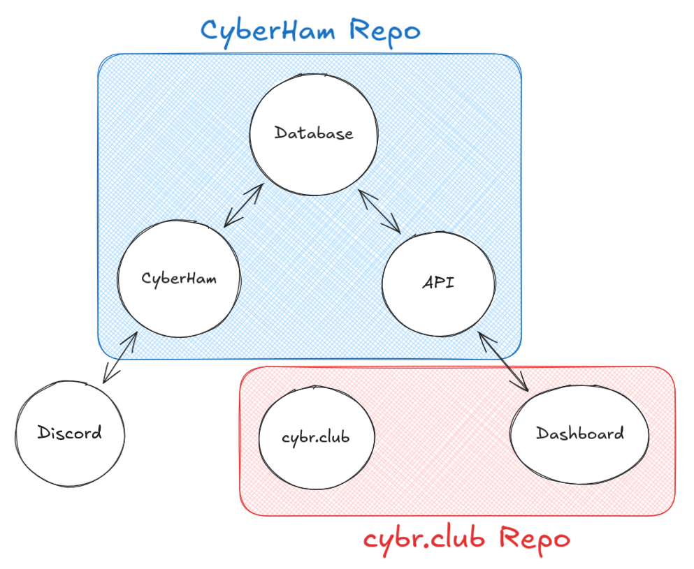

# Initiation

Welcome to the Technology Committee! Follow these steps to get set up with our repositories.

## Onboarding

- Tech Committee Discord server
    - Ask for an invite to the Discord server
    - We conduct all our communications here, so make sure you enable notifications
- Meeting schedule
    - We meet once a week, alternating location every other week
    - On off-weeks, we meet on Discord for a 15 minute standup only
    - On on-weeks, we meet in person for a standup and deeper discussions
- Tasks
    - Our [project board is public](https://github.com/orgs/tamucybersec/projects/5/views/2)
    - It lists all the necessary details to complete various assignments for all the infrastructure we maintain

## Setup

- Repositories
    - Our two main repositories are [CyberHam](https://github.com/tamucybersec/CyberHam) and [cybr.club](https://github.com/tamucybersec/cybr.club)
    - Follow READMEs to setup each respective repository
        - It is suggested you start with cybr.club, as it is simpler
- Look over the code
    - Record
        - One thing you learned about how the system works
        - One thing you found surprising or non-obvious
        - One thing you could not explain to someone else yet
    - Be ready to share it at the next meeting's standup

## Architecture

- Data flows following the arrows
